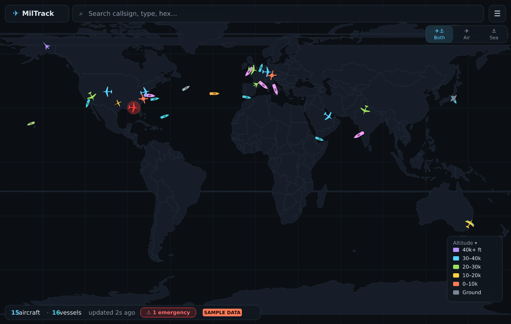
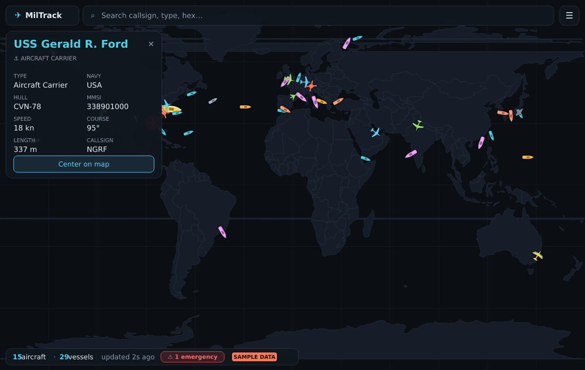

# Military Flight Tracker

A Progressive Web App that shows **live military aircraft worldwide** on a dark
map. Works in the browser on iOS (Safari) and Android (Chrome) and installs to
the home screen — no app stores.


## Demo

Rendered from the app's real sample data, glyphs, and layout (`npm run demo`):

| World overview | Aircraft selected |
| --- | --- |
|  |  |

## Features

- 🌍 Full-screen dark world map (CARTO basemap) with live military **aircraft and naval vessels**
- ✈️ Type-aware aircraft icons — fighters, heavies/tankers, helicopters and
  drones get distinct glyphs — colored by altitude, auto-refreshing
- ⚓ **Military vessel tracking** — carriers, destroyers, cruisers, frigates,
  submarines, patrol and support ships as rotating hull glyphs colored by class
- 🔀 **Air / Sea / Both** layer toggle
- 🚨 **Emergency highlighting** — aircraft squawking 7500/7600/7700 (or an ADS-B
  emergency) pulse red/orange and are surfaced in the list and status bar
- 🔔 **Alerts & watchlist** — star contacts to watch them (gold ring on the map);
  get toast alerts (with optional sound + browser push) when an emergency
  squawk appears or a watched contact returns to coverage; an Alerts tab logs
  events and holds the settings
- 👆 Tap any contact for details (aircraft: class, callsign, type, reg, hex,
  squawk, altitude, speed, heading; vessel: type, navy, hull, MMSI, speed, course)
- 🎯 **Follow mode** keeps a selected aircraft centered as it moves
- 🔗 **Shareable deep-links** — the selected aircraft is encoded in the URL
  (`#sel=<hex>`) and restored on reload
- 🔎 Search/filter across both aircraft and vessels
- 📋 Sortable, tabbed list view (Aircraft | Vessels)
- 🛰️ Flight/voyage trails for the selected contact (or all aircraft trails)
- 🗺️ Altitude color legend
- 📲 Installable PWA with offline app shell

## How it works

```
airplanes.live /v2/mil/  ──(server polls ≤1×/2s)──►  Express proxy + cache
                                                          │  GET /api/mil
                                          same-origin     ▼
                            React PWA  ◄── (no CORS, no rate-limit risk)
```

A single Node/Express server polls the free [airplanes.live](https://airplanes.live)
military feed, caches it in memory, and serves both the cached data (`/api/mil`)
and the built PWA. The browser only ever talks to our own origin, so there's no
CORS issue and the upstream sees at most one request every couple of seconds no
matter how many users are connected (staying under its 1 req/sec limit).

## Getting started

```bash
npm install        # installs web + server workspaces
npm run dev        # Express on :3001, Vite on :5173 (open the Vite URL)
```

Then open http://localhost:5173.

### No outbound access to the data feed?

Some sandboxed/corporate networks block `api.airplanes.live`. Run with bundled
sample data so the whole UI is still demonstrable:

```bash
USE_SAMPLE_DATA=1 npm run dev
```

A `SAMPLE DATA` badge appears in the status bar when this is active.

## Tests & checks

```bash
npm test        # unit tests for classification, emergencies, vessels, filtering, trails
npm run typecheck
```

## Deploy (get it on your phone)

See **[DEPLOY.md](./DEPLOY.md)** for one-click options (Render Blueprint via
`render.yaml`, Railway, Fly.io, or any Docker host) and "Add to Home Screen"
instructions. The server health check is `/api/health`.

## Production build

```bash
npm run build      # builds the PWA into web/dist
npm start          # single server serves the PWA + proxy on :3001
```

Open http://localhost:3001. On a phone (same network) use "Add to Home Screen".

## Configuration (env vars)

| Variable           | Default                                  | Purpose                              |
| ------------------ | ---------------------------------------- | ------------------------------------ |
| `PORT`                 | `3001`                                   | Server port                              |
| `UPSTREAM_URL`         | `https://api.airplanes.live/v2/mil/`     | Aircraft feed (ADS-B Exchange v2)        |
| `VESSELS_UPSTREAM_URL` | _(unset)_                                | Live AIS vessel feed (see note below)    |
| `AISSTREAM_API_KEY`    | _(unset)_                                | Live military AIS via aisstream.io       |
| `POLL_INTERVAL_MS`     | `2000`                                   | Upstream poll interval                   |
| `USE_SAMPLE_DATA`      | _(off)_ set `1`                          | Serve bundled aircraft sample on failure |

The aircraft upstream is swappable for any ADS-B Exchange v2-compatible feed
(e.g. adsb.fi) via `UPSTREAM_URL`.

### A note on vessel data

Unlike military aircraft (airplanes.live offers a clean `/v2/mil` feed), there
is **no free "military vessels only" feed** — warships routinely disable AIS, so
live coverage is sparse. By default the server therefore serves a **curated set
of notable navy vessels** (29 ships across 15 navies) with simulated movement,
so the sea layer is always demonstrable. For real positions either:

- Set **`AISSTREAM_API_KEY`** (free key from [aisstream.io](https://aisstream.io)) —
  the server opens a WebSocket and filters the global AIS firehose to
  likely-military contacts (AIS ship type 35 + navy name prefixes), or
- Point **`VESSELS_UPSTREAM_URL`** at any source returning `{ "vessels": [ ... ] }`.

Live AIS coverage of warships is inherently sparse and the type-35/name
heuristic is approximate; this adapter is experimental and isn't exercised in
the sandbox.

## Project layout

```
shared/types.ts     Domain types shared by server + web
server/src/         Express proxy: milCache (poller), index (routes + static)
web/src/
  map/              MapView, AircraftLayer (imperative markers), TrailsLayer
  store/            Zustand store + selectors
  components/       SearchBar, DetailPanel, AircraftList, StatusBar
  hooks/usePolling  Visibility-aware poll loop
```

## Data & attribution

Aircraft data © [airplanes.live](https://airplanes.live) (free, non-commercial).
Basemap © OpenStreetMap contributors © CARTO.
